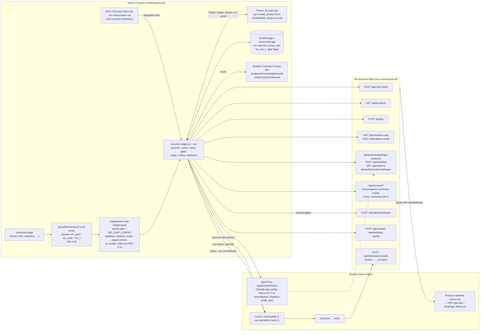

# docs/frontend — the storefront widget and theme

This folder is the one place for everything about the motionsports.de storefront (a Shopify theme) and the Mo chat widget inside it: the **widget contract** (what the widget sends, receives and renders), the **as-built** description of the widget and theme, and the current **frontend tasks**. Backend internals, legal rationale and operator how-to live in the backend docs (`docs/*.md`).

> **As-built chapters `01`–`07`:** they describe the theme repo `ms_shopify_clone`, branch `main` at `3e87341` (PR #73 "customer platform" `a0df103`, the fixes `8d0a0c4` and two added `endSpeaking()` calls), written by reading that tree. Endpoint behaviour is defined only by the three contract files below; the chapters point to their sections instead of repeating them. Where anything here disagrees with code, the code wins (backend code for endpoints, the theme repo for widget behaviour). The chapters are refreshed after each widget upload (`docs/ROLLOUT_TODO.md` C.22). Production state is not kept here (§4).

Use the as-built chapters to (a) predict exactly what the widget will do with a backend change, (b) plan features and KPI work, and (c) write frontend tasks that the frontend agent can implement without guessing.

---

## Contents

1. [How to use this folder](#1-how-to-use-this-folder)
2. [Which chapter answers which question](#2-which-chapter-answers-which-question)
3. [Mo frontend at a glance](#3-mo-frontend-at-a-glance)
4. [Where live status lives](#4-where-live-status-lives)
5. [Rules for widget changes](#5-rules-for-widget-changes)
6. [Glossary](#6-glossary)
7. [Quick-reference index](#7-quick-reference-index)

---

## 1. How to use this folder

| File | What it is | Reader |
| --- | --- | --- |
| [`API_CONTRACT.md`](API_CONTRACT.md) | The wire contract: §0 rules for every widget change, every widget-facing endpoint except `/api/auth/*` and `/api/account/*` (§1–§11), KPI event names and the server-only list (§5), session lifecycle (§6), locale (§12), changes since 2026-10-01 (Appendix A) | Frontend agent (attached to every task); backend agents (the contract) |
| [`ACCOUNT_CONTRACT.md`](ACCOUNT_CONTRACT.md) | Shapes and widget behaviour of `/api/auth/*` (login, code redeem, App Proxy whoami, `/api/auth/me`, logout) and `/api/account/*` (history, summary, export, erase, marketing opt-in), incl. when the post-sign-in opt-in may be shown (§6.1) | Frontend agent; backend agents |
| [`CONSENT_CONTRACT.md`](CONSENT_CONTRACT.md) | When and how the widget renders the consent surfaces (golden rules, sign-in ask, capture form); shapes stay in the two files above | Frontend agent; backend agents |
| [`tasks/`](tasks/README.md) | The current frontend prompt (`tasks/README.md`, with the attachment list) and its task files | Frontend agent (the operator sends them); finished tasks move to `docs/archive/` |
| `README.md` (this file) | Index of the folder, where live status lives, glossary | Backend agents |
| [`01-storefront-theme.md`](01-storefront-theme.md) | The Shopify theme around Mo: vendor theme, page skeleton, templates, product page, header/cart, apps, consent banner, locales, settings, metafields, URL params, deploy model | Backend agents: where Mo sits on a page, who owns which file, what can change without a theme deploy |
| [`02-widget-architecture.md`](02-widget-architecture.md) | Widget internals: boot order, config and page context, file map, state, **every storage key**, session id lifecycle, multi-tab, network surface, layout, stacking, CSS, i18n, a11y, errors | Backend agents: how the widget is built, how a session behaves, what leaves the browser |
| [`03-chat-protocol-and-rendering.md`](03-chat-protocol-and-rendering.md) | One chat turn end to end: triggers, the `POST /api/chat` body as sent, page context, SSE parsing, tool registry, each tool card, Markdown, errors, history, threads, PDF, feedback, voice | Backend agents: changing anything in `/api/chat`, tools, product data or prompts |
| [`04-accounts-sign-in-and-consent.md`](04-accounts-sign-in-and-consent.md) | Identity tiers, sign-in round trip with the one-time code, whoami, signed-in UI, cleanup rules, sign-in popup, every consent surface, legal rules in code | Backend agents: accounts, opt-ins, consent copy, privacy |
| [`05-engagement-and-kpi.md`](05-engagement-and-kpi.md) | All 35 KPI event names (45 `track()` call sites), transport, session joins, nudge/bounce/CTA/deep link mechanics, `_mo` attribution, how the dashboard reads events, measurement gaps and KPI ideas | Backend agents: any KPI or dashboard work |
| [`06-commerce-and-storefront-integration.md`](06-commerce-and-storefront-integration.md) | Every shop ⇄ Mo touchpoint: page facts, PDP CTA, `custom.qa`, `/api/products` fields, links, cart sync, attribution stamp, shop login vs Mo sign-in, prices/locales, DOM hooks | Backend agents: product data, cart, checkout, attribution, Q&A metafield |
| [`07-feature-and-kpi-playbook.md`](07-feature-and-kpi-playbook.md) | For planning: backend-only vs widget vs theme change, extension patterns, the frontend task template, contract-change rules, testing and live checks, the prioritised opportunity backlog | Backend agents: before planning a feature or writing a frontend task |

The frontend agent gets the three contract files and the task files, not `README.md`/`01`–`07`: its own repo is its source of truth, and each task restates the as-built facts it needs.

**Suggested reading order**

- *First contact:* this README → `07` §1–§2 (decision guide) → skim the "At a glance" table of each chapter.
- *Planning a feature:* `07` (pattern + backlog) → the chapter for the area → the contract section it cites.
- *Writing a frontend task:* `07` §4 (template), `API_CONTRACT.md` §0 (rules) and `07` §5 (contract-change rules), then copy the exact function names and storage keys from the relevant chapter.
- *Debugging a KPI number:* `05` §3 (session semantics), §4 (catalogue), §12 (dashboard reading).

**Conventions used in all chapters**

- Code locations are `file → function / selector / key`, never line numbers (they drift). Example: `ms-chat-widget.js → presentLoginGate()`.
- Contract and backend references:

  | Alias | File |
  | --- | --- |
  | **AC §n** (also "API_CONTRACT §n") | [`API_CONTRACT.md`](API_CONTRACT.md) |
  | **ACCT §n** | [`ACCOUNT_CONTRACT.md`](ACCOUNT_CONTRACT.md) |
  | **CONS §n** | [`CONSENT_CONTRACT.md`](CONSENT_CONTRACT.md) |
  | **AD §n** | [`../ADMIN_DASHBOARD.md`](../ADMIN_DASHBOARD.md) |
  | **OA** | [`../ORDER_ATTRIBUTION.md`](../ORDER_ATTRIBUTION.md) |
  | **CMP §n** | [`../CAMPAIGNS.md`](../CAMPAIGNS.md) |
- German UI strings are quoted verbatim. Everything marked "unverified" or "open question" is exactly that: the chapters describe the source, not tests against the live shop.

---

## 2. Which chapter answers which question

| Question | Answer in |
| --- | --- |
| Which rules must every widget change (and every backend change the widget relies on) keep? | AC §0; enforcement map: §5 below |
| What exactly does an endpoint accept and return? | AC §1 endpoint table → the endpoint's section (AC or ACCT) |
| Which widget build is live, and which backend switches are on? | §4 below (`docs/ROLLOUT_TODO.md`, `npm run verify:widget`) |
| On which pages does Mo appear, and where exactly on the product page? | `01` §5, §6; `06` §3 |
| Who owns which theme file, and how does a change reach the live shop? | `01` §2.3, §16 |
| What can I change from the backend without anyone uploading theme files? | `01` §17.1; `06` §15.1; `07` §2 |
| What does the widget do on page load before the visitor clicks anything? | `02` §2.6 |
| Which browser storage keys exist, what do they hold and when are they cleared? | `02` §6 (complete list) |
| When does the session id change, and what does that do to KPI joins? | `02` §7; `05` §3 |
| Exactly what is in a `POST /api/chat` body, and when? | `03` §3 (contract: AC §2) |
| Does Mo know which product page the visitor is on? | `03` §2, §4; `06` §2.4 (only via CTA or nudge click; typed turns: AC §2 `context.source: "page"`, widget side = `tasks/TASKS.md` task 2) |
| What happens to a new tool name I add? | `03` §6; `07` §3.1–§3.2 |
| Which product fields render, which are ignored? | `03` §7 (contract: AC §3) |
| What does the widget do with each HTTP error code from `/api/chat`? | `03` §11; `02` §18 |
| How does sign-in work end to end? | `04` §4 (contract: ACCT §2, §2a; the pre-PR #73 widget before 2026-10-04: `02` §1.1) |
| What is `optInActionable` used for, and which ask does a signed-in customer see? | `04` §10.2–§10.4 (contract: ACCT §6.1) |
| Which texts must come from the backend, which may live in the widget? | AC §0 rules 8–11; `04` §11 |
| Which KPI events exist, with which `data`, fired where? | `05` §4; location index in `02` §19 |
| Which events must the widget never send? | AC §5 (server table); `05` §5 |
| Why is the dashboard "Engagement" ratio misleading? | `05` §12 |
| How does order attribution (`_mo`) work, and where are the gaps? | `05` §10; `06` §8 (contract: AC §10) |
| Does the in-chat "Zur Kasse" checkout get attributed? | `05` §10.3; `06` §8.7 (probably not, unverified) |
| How do campaign links open Mo, and what counts as a campaign chat? | `05` §9; `01` §15 |
| How is the PDP Q&A tab built from `custom.qa`? | `06` §4; `01` §6.5 |
| What should we build next for KPI X? | `07` §7; `05` §13.4 |

---

## 3. Mo frontend at a glance

- **Storefront:** Shopify Online Store 2.0, vendor theme **Essence 4.1.0** (Alloy Themes), German default, English under `/en`. Cart is a drawer (`<cart-modal>`). Theme JS is the minified vendor bundle `assets/main.mjs` (read-only).
- **Mo footprint in the theme:** one snippet (`snippets/ms-chat-widget.liquid`), two assets (`assets/ms-chat-widget.js` ~6.3k lines vanilla ES5 IIFE, no build step; `assets/ms-chat-widget.css` ~1.8k lines), an "AI Advisor" settings section, an inline `<head>` script plus the render call in `layout/theme.liquid`, the "MO only" CTA block in `templates/product.json`, `product.produkt-new`, `product.produktnew` and `product.produkte-im-set` (plus the older Kurzinfo variant in `product.produktdesign-02`), and the Q&A tab (`snippets/product-qa.liquid`, `sections/tabs-cards.liquid`). Full list: `01` §2.3.
- **Mounting:** only when the theme setting `ai_advisor_enabled` is on (master switch; also gates the head stash script), then on every page that uses the theme layout, except `/cart` (substring test `template contains 'cart'`), checkout, the password page (separate `password` layout) and templates listed in `ai_advisor_excluded_templates` (default value: `cart`; not overridden in `settings_data.json`). The gift-card page uses the theme layout and very likely shows the launcher unless `gift_card` is added to `ai_advisor_excluded_templates` (unverified on live). No mount with an empty `settings.ms_chat_shared_secret`: the snippet then renders neither config nor JS. Wherever it does not render (excluded template, cart/checkout, empty secret) it outputs a `<style>` that hides `.ms-chat-product-advisor` / `.ms-chat-product-cta`, so the PDP CTA is hidden instead of dead. Gate rules: `01` §5.1.
- **Entry points:** floating launcher (orb), contextual nudge, PDP CTA „Detaillierte Beratung zu diesem Produkt“, deep link `?mo=open` / `#mo-open`, sign-in return. A generic "open Mo with a topic" JS API does **not** exist (`06` §3.2).
- **Identity:** a device UUID `sid` in `localStorage['ms-chat-sid']` is the session, the KPI `sessionId`, the rate-limit key and, once a one-time code is redeemed, the link to a Shopify customer.
- **Data out of the browser:** chat history and optional context to `/api/chat`; ids and enums to `/api/kpi`; product ids to `/api/products`; an opaque `_mo` token into the Shopify cart (only with analytics consent). Plus user-entered PII on explicit form submits (contact form: name/email/organization/phone/message/productIds → `/api/contact`; capture form: email + `consentTextShown` → `/api/capture-email`; feedback: text + sessionId + page path + tier + known email (+ `conversationId` when signed in) → `/api/feedback`), reply text to `/api/tts` in voice mode, `customer.email` (after a capture in this page view), `campaignToken` and `conversationKey` on `/api/chat`, the sid as `?session=` on login/auth/me/whoami (AC §0 rule 6), and the full current page URL (query string included, e.g. `utm_*` or search terms) as `return_url` on the sign-in redirect (`initiateLogin()`, `06` §8.6). Never names, emails or message text in KPI events. Details: `02` §9, `04` §13.
- **Deployment:** manual. The owner copies files from `main` into the Shopify code editor using `MANIFEST.md`. A second person edits the same theme in the live editor (`01` §16).

### Architecture

---

## 4. Where live status lives

These docs describe behaviour, never production state ("what is uploaded", "what is switched on"). That lives in exactly two places:

| Question | Where |
| --- | --- |
| Which widget build is live, which backend switches are on, what the operator still has to do (live checks, App Proxy setup, refresh of these docs after an upload) | [`docs/ROLLOUT_TODO.md`](../ROLLOUT_TODO.md) — operator truth (e.g. 1.11 live check after an upload, 5.4 App Proxy, C.22 doc refresh) |
| Which build the shop is serving right now | `npm run verify:widget` (`scripts/check-live-widget.mjs`) over [`src/lib/widget-fingerprint.mjs`](../../src/lib/widget-fingerprint.mjs) (`WIDGET_BUILDS`: markers per build, the `current` row, what each build means for the backend) — build truth; how to read it: `07` §6.4 |
| How to read KPI data recorded before a widget release | `02` §1.1 (the pre-PR #73 widget, live until 2026-10-04); release dates the KPI tab annotates: `src/lib/kpi-releases.mjs` (`05` §12.1) |

Backend switches that change what the widget sees are documented with their default in code (`.env.example`), all `false` / `0` by default: `CHAT_ORDER_STATUS_ENABLED` (AC §2), `APP_PROXY_SIGNIN_ENABLED` and `APP_PROXY_SIGNIN_MAX_AGE_HOURS` (ACCT §3a), `CHAT_PAGE_CONTEXT_ENABLED` (AC §2 "Optional `context`"), `MO_ATTRIBUTION_SESSION_ANCHOR` (OA). The status snapshot these chapters carried on 2026-10-04 is archived: [`docs/archive/FRONTEND_STATUS_2026-10-04.md`](../archive/FRONTEND_STATUS_2026-10-04.md).

### Known open items (index of the chapters' findings)

Widget bugs and gaps of `3e87341`, one line each; the detail is in the cited chapter. Items 1, 2 and 6 were fixed on 2026-10-04 and keep their numbers so references stay stable.

1. *(fixed 2026-10-04)* New chat / open conversation cancel a streaming reply first (`startNewChat()`, `openConversation()`). `02` §7.3, §21 item 1.
2. *(fixed 2026-10-04)* `contact_form_submitted` is session-keyed: the widget sends `sessionId` in the `POST /api/contact` body, and the backend falls back to `x-ms-session` (AC §4). Rows from before the 2026-10-04 upload have `sessionId: null`. `03` §20.1.
3. **The 21st user message fails** with `payload_too_large`: the widget sends the uncapped in-memory history; storage keeps 40, so it fails again after reload. `03` §3.3.
4. **"Zur Kasse" permalink carries no `_mo`**, and only `show_product` cards mark a session "consulted". `05` §10.3, `06` F1/F2.
5. **Typed messages carry no page context**, even on a PDP. `03` §2, `06` F3. → `tasks/TASKS.md` task 2; the backend side is built (AC §2 `context.source: "page"`, `CHAT_PAGE_CONTEXT_ENABLED` default off in code).
6. *(fixed 2026-10-04)* `order_support` has its own contact-form label and order-number placeholder. `03` §8.5.
7. **Dashboard "Engagement" ratio is skewed** by interaction-free `launcher_attention_played` / `nudge_shown`. `05` §12.
8. **Two product id spaces in KPIs** (`product_cta_opened` numeric, other product events catalog handles). `05` §4.4.
9. **Capture card re-renders for a signed-in customer after reload** (restored history; a live offer no longer reaches a signed-in session, AC §2 `offer_email_summary`), and form cards come back empty after every reload (double submit, repeated `email_capture_declined`). `04` §18.2, `03` §8.6, §12.
10. **Dead CTA, remaining edge:** if `ms-chat-widget.js` fails to load, or the visitor clicks before the deferred JS has booted, the button does nothing. (Fixed 2026-10-04: the CTA is hidden where the widget does not render, and all five product templates carry it.) `product.produkte-im-set` has no Q&A tab. `01` §6.6, `06` §3.4.
11. **`add_to_cart` with more than 10 ids renders nothing** (no chunking). `03` §8.3.
12. **Widget ignores `enLegalReviewed`** (no reference in `ms-chat-widget.js`) — harmless: the English copy is approved as the translation and served with `enLegalReviewed: true` (AC §12.3). Voice recognition and the local TTS fallback are hard-coded `de-DE`.
13. **KPI telemetry is not consent-gated**, and the sid is written for every visitor on first load. Open legal question (§ 25 TDDDG). `05` §13.3.
14. **Output-less tool parts are replayed as `output-available`.** `accumulatePart()` sets `state: 'output-available'` as soon as `input` is present, so a tool part with no output is replayed as complete without `output`; the backend drops only `input-streaming` / `input-available` parts (AC §2 "Request body"). Provider impact unverified. `03` §20.14.
15. **An `error` SSE chunk with no content keeps the user message** in history without a reply. The next send carries two consecutive user messages. `03` §20.7, `02` §21.17.
16. **Restored history costs backend calls on every page view** (`/api/products` re-fetches, and a restored `show_product` card can mint/stamp the attribution token without interaction). Dashboards counting those calls see page views, not chat activity. `02` §21.16.
17. **Stale `_mo` after a sid rotation.** `moAttrReset()` clears only the local cache, not the cart attribute. `06` F8. → `tasks/TASKS.md` task 3 (blank the marker, AC §10).
18. **`capturedEmail` survives an anonymous "Neuen Chat starten"** and is still sent as `customer.email` under the new sid. `03` §20.19, `04` §18.14.
19. **`account_signin_return {result:'ok'}` is sent before `/api/auth/me` confirms.** If the probe fails, "ok" is counted while the UI shows anonymous. `04` §18.4.

Full lists: `02` §21, `03` §20, `04` §18, `06` §16; prioritised backlog: `07` §7.

---

## 5. Rules for widget changes

The one canonical list is **AC §0** (25 rules, cited as "§0 rule n"). It binds backend changes too: the widget relies on every rule. This section only maps each rule to where the widget enforces it.

| AC §0 rules | Where the widget enforces it | Chapter |
| --- | --- | --- |
| 1–2 form factor, delivery | one ES5 IIFE, `MANIFEST.md` entry per change | `02` §1, §16, §20; `01` §16 |
| 3 additive contract changes | the widget sends no version header | `07` §5 |
| 4–5 no new request header, the shared secret is not authentication | only `x-ms-chat-key`, `x-ms-session`, `x-ms-locale` are sent; `CHAT_KEY` comes from the theme setting and is public in the page | `07` §1, §5 rule 2; `01` §12.1 |
| 6 one session id | `getSid()`, the rotation list, `onSidChangedElsewhere()` | `02` §7, §8; `05` §3 |
| 7 raw sid never in a cart attribute or shop URL | `moStampCart()` (the sid does go to the backend as `?session=` on login, `/api/auth/me` and same-origin whoami) | `06` §8 |
| 8–11 served consent copy, nothing pre-selected, fail closed, served vs chrome | `presentConsentGate()`, `buildMarketingOptInCard()` (need `lawyerApproved === true`), `buildCaptureCard()` (no `lawyerApproved` check), served strings via `textContent` | `04` §10, §11 |
| 12 additive tiers | `buildToolCard()` suppression; known violations: open item 9, `02` §21 item 10 | `04` §10.8 |
| 13–15 KPI payloads, server-only names, dashboard patterns | `track()` call sites | `05` §2.3, §5, §12 |
| 16 unknown / silent tools | `VISIBLE_TOOLS`, `SILENT_TOOLS`, `resolveToolName()` | `03` §6 |
| 17 Markdown safety | `renderMarkdownInto()`, `safeHref()` | `03` §9 |
| 18 fail silent extras, fail closed identity | `try/catch` around extras, `applyAuth()` | `02` §18 |
| 19 privacy posture | `PAGE_CTX`, the trail, `recentlyViewedPayload()` | `03` §4.4 |
| 20 `customer.email` | `capturedEmail` (known deviation: survives a new anonymous chat, open item 18) | `03` §3.2 |
| 21 campaign token | `captureCampaignToken()`, `ms_mo_c` | `05` §9 |
| 22 tone | `nudgeCopy()` (the streak copy breaks the tone rule) | `05` §7.3 |
| 23 sign-in as a top-level redirect, counted after the code redeem | `initiateLogin()`, `redeemLinkCode()` | `04` §4 |
| 24 shared limits | `hydrate()` batches of 10, `TRAIL_*`, `splitIntoTtsChunks()`, the 40-message storage cap | `07` §5 |
| 25 theme ownership | — (people in the theme editor) | `01` §13, §16, §17 |

Not a widget rule but read every count with it: a "session" (sid) is not a visit — the sid persists in localStorage across visits, and "once per session" UI caps are per **tab** session (`05` §3.2).

---

## 6. Glossary

| Term | Meaning |
| --- | --- |
| **Mo** | The AI product advisor: the chat widget on motionsports.de plus its backend at `mo.motionsports.de`. |
| **Widget** | `assets/ms-chat-widget.js` + `.css`, mounted by `snippets/ms-chat-widget.liquid`. Everything renders under `.ms-chat-root`. |
| **Launcher** | The floating round orb button bottom-right (`.ms-chat-launcher`). Hidden while a theme drawer locks scroll (`body.no-scroll`). |
| **Panel / view modes** | The chat window. Desktop: docked **sidebar** (default, page shifts left) or centred **modal**; mobile (≤ 640 px): fullscreen. |
| **Orb** | The animated brand mark (`.ms-chat-logo`), injected into every empty `.ms-chat-logo` span, including the PDP CTA. |
| **PDP** | Product detail page (`templates/product*.json`). |
| **CTA / "MO only" block** | The PDP button „Detaillierte Beratung zu diesem Produkt“ (`custom_liquid_AErEyg` in `templates/product.json`, `product.produkt-new`, `product.produktnew` and `product.produkte-im-set`; the Kurzinfo variant in `product.produktdesign-02`). Any element with `.ms-chat-product-cta` + `data-ms-chat-product-id` / `-title` works as a CTA (`06` §3). |
| **Primer message** | The visible user message the CTA sends (`openWithProduct()`), exactly: `Ich interessiere mich für „<Titel>". Kannst du mich zu diesem Produkt beraten?` (opening „, closing ASCII `"`). Without a title: `Kannst du mich zu diesem Produkt beraten?`. Sent with `context.type: "product"`. |
| **Context greeting** | A `/api/chat` turn with `messages: []` plus `context`, sent when a nudge is clicked on a fresh conversation. No user bubble, no `message_sent`. |
| **Nudge** | The proactive speech bubble above the launcher. Triggers (`initNudgeTriggers()`): dwell 24 s on product/collection pages, scroll ≥ 85 % on product pages, exit intent on desktop (> 640 px) only; first trigger wins. Never while the panel is open or if it was opened this tab session (`nudgeEligible()`). Once per tab session, never again after ×. Mobile pages other than product/collection get no nudge, and desktop non-product/collection pages only exit intent; keep this in mind when reading `nudge_shown` per `pageType`. |
| **Attention bounce** | One launcher bounce 1.4 s after load, once per tab session; fires `launcher_attention_played`. |
| **Tier 1 / 2 / 3** | 1 = anonymous (sid only). 2 = email-only: a capture in **this page view** put the address in memory (`capturedEmail`), sent as `customer.email`. 3 = signed in via a redeemed one-time code (`/api/auth/me` `signedIn: true`). |
| **sid** | The device session id, UUID in `localStorage['ms-chat-sid']`. AC §0 rule 6; lifecycle `02` §7. |
| **conversationKey** | Client UUID naming a signed-in thread, sent on `/api/chat` only when signed in. Lets several threads live under one sid (ACCT §7.6). Anonymous threads have none. |
| **Thread** | One conversation. Anonymous: one per sid. Signed in: one per `conversationKey`, listed in the history drawer. |
| **One-time code** | `ms_code` on the sign-in return, or `linkCode` from whoami. 10 min, single use, redeemed at `POST /api/auth/link` with the login's sid (ACCT §2a). |
| **auth-via (`chat` / `shop`)** | How this sid was linked: `'chat'` = the chat's own „Anmelden“; `'shop'` = recognised through whoami. Order status needs a chat sign-in (ACCT §3a). |
| **App Proxy / whoami** | Shopify forwards the same-origin path `/apps/chat/whoami` to the backend (`/api/auth/storefront/whoami`; Shopify appends the sub-path to the proxy URL `…/api/auth/storefront`) with an HMAC, a signed `timestamp` (±5 min) and `logged_in_customer_id`. The widget uses an answer only to redeem its `linkCode` (`04` §5). The backend issues a code only with `APP_PROXY_SIGNIN_ENABLED` and a proof (`APP_PROXY_SIGNIN_MAX_AGE_HOURS`), both default off in code (ACCT §3a). The proxy is Shopify app configuration (`docs/ROLLOUT_TODO.md` 5.4); unconfigured, the path returns Shopify's HTML 404 and the widget falls back silently. The pre-PR #73 widget treated a `signedIn: true` answer as identity without a code (`02` §1.1). |
| **Gate / first-message popup** | The one dialog per tab session (`ms-chat-gate-shown`), scheduled 0.7 s after the user's send (`sendMessage()` → `maybeShowConsentGate()`): skipped if that send was already rolled back, the panel is closed or input is rate-locked; waits up to 5 s (10 × 500 ms) for the auth tier to settle; usually appears while the reply still streams, so the turn's success is not yet known. Never in voice mode. Either the **login gate** (anonymous, sign-in popup, 24 h snooze) or the **consent gate** (signed in, marketing opt-in, `optInActionable` + `lawyerApproved`). |
| **Inline opt-in card** | The in-thread consent card after a mid-conversation chat sign-in. Same served copy and POST as the consent gate. |
| **Capture form** | The two-checkbox email form for tiers 1–2 (`offer_email_summary` card or header „Per E-Mail teilen“). |
| **Surface** | (a) The `?surface=` variant of `GET /api/consent-copy`: default (capture form), `signin`, `chat` (retired in the widget), `erase` (AC §7.4). (b) The `data.surface` field on `consent_gate_*` KPI events (the widget sends `'signin'`; AC §5). |
| **Served copy vs chrome** | Served = legal/consent text from the backend, rendered verbatim. Chrome = UI labels the widget owns (`L(de, en)` and copy tables). AC §0 rule 11. |
| **DOI** | Double opt-in: marketing consent becomes effective only after the confirmation link (`/api/confirm-marketing`). A consent "accept" in KPI is the tap, not the DOI. |
| **`optInActionable`** | `/api/auth/me` → `marketing.optInActionable`. The backend's master switch for whether a signed-in customer may be asked for marketing consent (ACCT §6.1). |
| **`lawyerApproved`** | Flag on served copy. For `surface=signin`, anything but `true` means render nothing. |
| **`consentTextShown`** | The audit string of exactly what was shown; returned unchanged in the submit. |
| **Visible / silent tool** | Visible tools render cards (`show_product`, `compare_products`, `add_to_cart`, `suggest_showroom`, `show_contact_form`, `offer_email_summary`). Silent tools are stored and replayed but never rendered (`update_customer_profile`, `search_products`, `get_order_status`). |
| **Hydration** | Fetching product data for card ids via `GET /api/products` (batches of 10, cached per page). |
| **Catalog id vs numeric id** | The backend catalog's product id is the handle (slug), optionally a variant ref `handle~<variantId>`. The theme's `product.id` is the numeric Shopify id. |
| **Cart permalink** | `https://motionsports.de/cart/<variant>:1,…`, the `cartUrl` that "Zur Kasse" opens in a new tab. Built by the backend; no `_mo`. |
| **`_mo` stamp / attribution token** | Opaque server token written as a cart attribute so the order webhook can attribute the order. The widget's stamp (token source `widget`) yields only „Beraten & gekauft“ (`assisted`) or „Beraten, anderes gekauft“ (`influenced`). „Direkt“ comes from Mo codes (MS5-/MK-) or Mo-built email/bundle cart links. Window: `MO_ATTRIBUTION_WINDOW_DAYS` (default 30) from the token mint; with `MO_ATTRIBUTION_SESSION_ANCHOR` (default off in code) for `widget` tokens from the session's latest product consultation. Retention purges a token window + 7 days (default 37) after that anchor, and with the switch at most `KPI_RETENTION_DAYS` (default 180) after minting; after a purge the endpoint mints a new one, but the `3e87341` widget keeps stamping its cached token (renewal: `tasks/TASKS.md` task 3, AC §10). Details: OA, `05` §10, `06` §8. |
| **Consulted** | Widget state that allows minting the attribution token. Set only when a `show_product` card renders. |
| **Deep link** | `?mo=open` or `#mo-open` (+ `mo_new=1`, `mo_view=fullscreen`): opens the panel on load. Sends no chat message and does not change the greeting. It behaves exactly like a launcher click: `chat_opened` (no source field, so deep-link opens can't be told apart) plus the normal open-time auth detection (`openPanel()` → `resolveAuthOnOpen()`). |
| **Campaign token (`mo_c`)** | Per-send token appended by `/api/r/<token>` to a campaign deep link; sent once as `campaignToken`; recorded server-side as session-less `campaign_chat_started` (AC §2 "Optional `campaignToken`", CMP). |
| **Head stash script** | Inline script at the top of `<head>` (PR #73) that moves `ms_auth`, `ms_code`, `mo_c` from the URL into `sessionStorage['ms-chat-early-params']` before Shopify analytics reads the URL. |
| **Trail** | Local browsing trail (`localStorage['ms-chat-trail']`, ≤ 5 entries, 3-day TTL). Sent only inside a CTA or nudge context as `recentlyViewed`. |
| **pageContext / `PAGE_CTX`** | Server-rendered page facts in `MS_CHAT_CONFIG.pageContext` (page type, product id/handle/title/type, collection) and the widget's normalised copy (`02` §3.2). |
| **Live editor** | The Shopify theme editor / code editor, where a second person edits templates, sections, app blocks and settings directly on the live theme. |
| **Re-sync / three-way merge** | Downloading the live theme and merging it into the repo with the previous snapshot as merge base (`01` §16.3). |
| **MANIFEST** | `MANIFEST.md` in the theme repo: dated changelog and per-session upload list with test checklists. |
| **Drift** | The live theme and the repo diverging (editor edits, missed uploads, bad syncs). |
| **`CHAT_ORDER_STATUS_ENABLED`** | Backend switch for the silent `get_order_status` tool, default off in code (while off, only the test accounts in `CHAT_ORDER_STATUS_TEST_CUSTOMERS` get it). The widget renders nothing for the tool part and keeps it for replay (`03` §6; AC §2 "Tools the widget MUST NOT render"). |

---

## 7. Quick-reference index

Each list has one owner; this section only points there.

| What | Complete list | Contract |
| --- | --- | --- |
| Endpoints the widget calls: headers sent, triggers, what leaves the browser | `02` §9 | AC §1 "Endpoints" (guard and bucket per route) |
| KPI events: names, `data`, trigger, function | `05` §4 (location index: `02` §19) | AC §5 |
| Browser storage keys | `02` §6 | — |
| URL parameters a storefront page reacts to | `01` §15 (deep link and campaign detail: `05` §9) | AC §2 "Optional `campaignToken`", ACCT §2 |
| Theme hooks and globals the widget depends on | `06` §12 | — |
| Visible and silent tools | `03` §6, §8 | AC §2 "Tools the widget MUST render" / „MUST NOT render“ |
| Page-context fields | `02` §3.2 | AC §2 "Optional `context`" |
